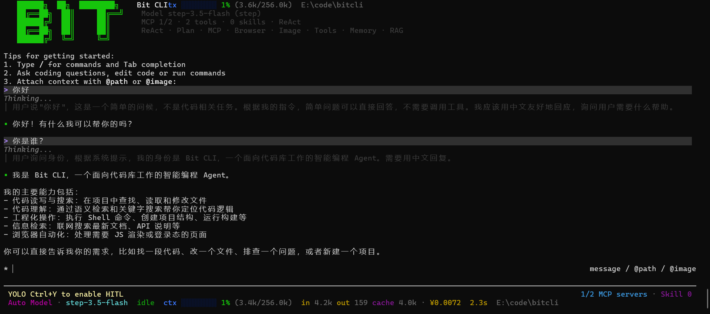
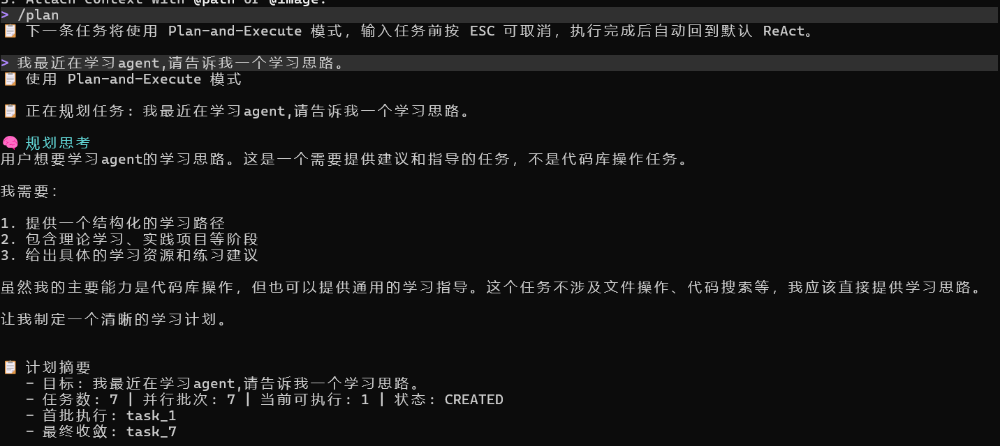
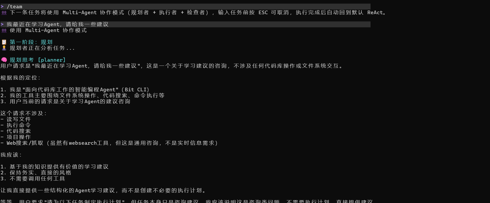
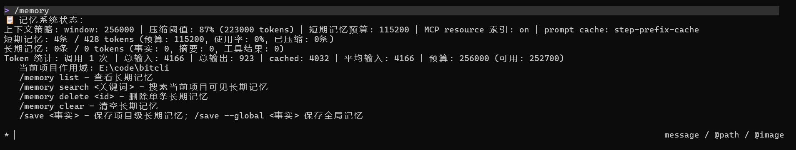

# Bit CLI

[](https://adoptium.net/)
[](https://maven.apache.org/)
[](#)
[](#)

> 面向编码工作流的 Java Agent CLI，集成 `Agent`、规划执行、`Memory / RAG`、`MCP`、`Browser`、`Renderer`、`Runtime`、`Skill` 和微信通道。

## ✨ 运行截图



<table>
  <tr>
    <td></td>
    <td></td>
  </tr>
  <tr>
    <td colspan="2"></td>
  </tr>
</table>

## 🚀 快速开始

```bash
mvn package
java -jar target/bitcli-1.0-SNAPSHOT.jar
```

## 🧩 能力概览

| 能力 | 说明 |
|---|---|
| `Agent` | 对话式代码理解与任务执行 |
| `Plan and Execute` | 先规划，再分步完成复杂任务 |
| `Multi-Agent` | 多 Agent 协作完成复杂任务 |
| `Memory / RAG` | 项目记忆、长期记忆和代码检索 |
| `MCP` | 管理外部工具与资源 |
| `Browser` | 浏览器联动与网页自动化 |
| `Renderer` | 终端与 TUI 展示 |
| `Runtime` | 对外提供运行时 API |
| `Skill` | 可复用技能加载与管理 |

## 🛠️ 常用命令

### 模型切换

| 命令 | 说明 |
|---|---|
| `/model` | 查看当前模型 |
| `/model glm-5.1` | 切换到 GLM-5.1 |
| `/model glm-5v-turbo` | 切换到 GLM-5V-Turbo 多模态 |
| `/model deepseek` | 切换到 DeepSeek（读取配置模型） |
| `/model step` | 切换到 StepFun（读取配置模型） |
| `/model kimi` | 切换到 Kimi（读取配置模型） |
| `/model freellmapi` | 切换到本地 FreeLLMAPI（读取配置模型） |
| `/model xfyun` | 切换到讯飞星辰 MaaS（读取配置模型） |
| `/model agnes` | 切换到 Agnes 2.0 Flash（读取配置模型） |

### 执行模式

| 命令 | 说明 |
|---|---|
| `/plan` | 下一条任务使用 Plan-and-Execute 模式 |
| `/plan <任务内容>` | 直接用计划模式执行这条任务 |
| `/team` | 下一条任务使用 Multi-Agent 协作模式 |
| `/team <任务内容>` | 直接用多 Agent 协作执行这条任务 |
| `/hitl` | 查看 HITL 状态 |
| `/hitl on` | 启用危险操作人工审批 |
| `/hitl off` | 关闭 HITL 审批 |

### 工具与运维

| 命令 | 说明 |
|---|---|
| `/browser` | 查看浏览器会话状态 |
| `/browser connect` | 复用已允许远程调试的登录态 Chrome |
| `/browser tabs` | 查看 shared 模式真实 Chrome tab |
|                    |                                   |
| `/task` | 查看后台任务列表 |
| `/mcp` | 查看 MCP server 状态 |
|                    |                                   |
|                    |                                   |
| `/index` | 索引当前代码库 |
| `/search <查询>` | 语义检索代码（RAG 辅助） |
| `/memory` | 查看记忆状态 |
| `/skill` | 查看 skill 列表 |
| `/export` | 导出当前会话对话记录为 Markdown |

## ⚙️ 配置

复制 [.env.example](.env.example) 为 `.env`，按需填写模型与密钥。

### 常见配置项

- `DEFAULT_PROVIDER`：默认模型提供商
- `GLM_API_KEY` / `STEP_API_KEY` / `DEEPSEEK_API_KEY`：对应厂商密钥
- `GLM_MODEL` / `STEP_MODEL` / `DEEPSEEK_MODEL`：模型名
- `STEP_BASE_URL`：StepFun 接口地址

## 📦 环境要求

- JDK 17
- Maven 3.9+

## 🎯 适合做什么

- 读代码、找调用链、解释实现
- 规划任务并分步执行
- 通过 `MCP`、`Browser` 和 `Runtime` 扩展能力边界
- 在终端里完成日常代码库工作流

## 🗂️ 项目结构

- `src/main/java`：核心实现
- `src/main/resources`：提示词、配置和静态资源
- `src/test/java`：测试
- `img.png`：README 中使用的启动界面截图
- `docs/images/`：补充截图
